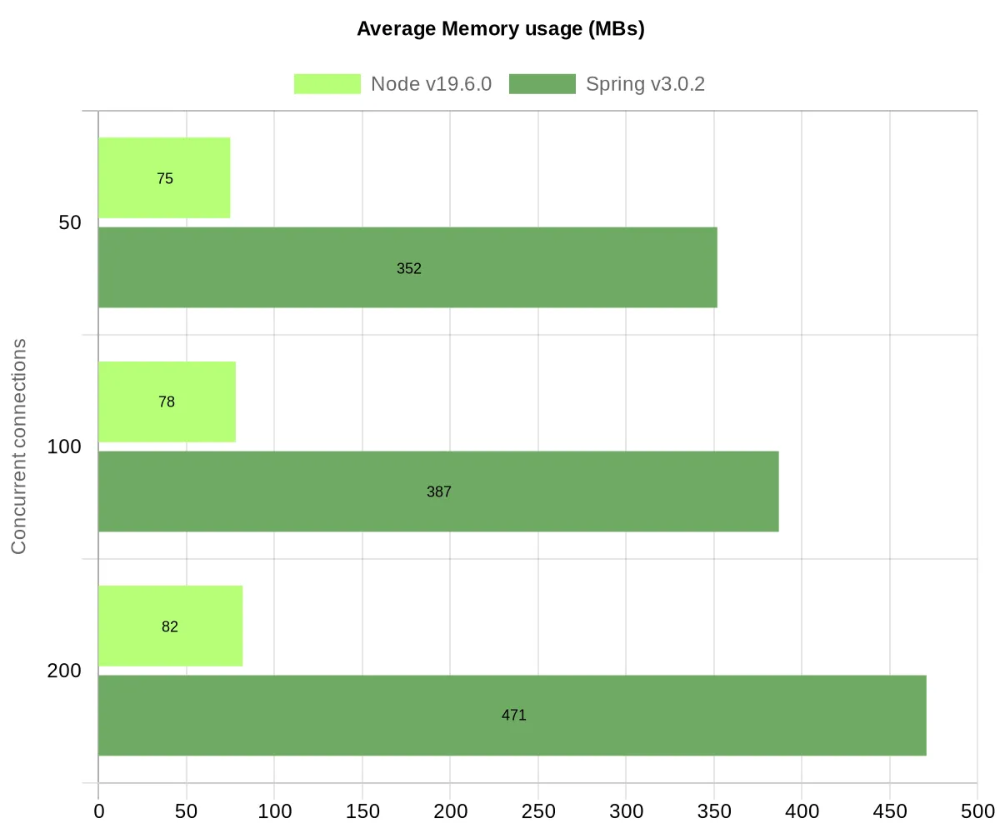

# Node.js 浅析

## 什么是 Node.js

官方定义 Node.js 是一个开源的，跨平台的 Javascript 运行时环境。

要理解这个定义需要从 Javascript 的前身谈起。在 2009 年 Node.js 出现之前，Javascript 只能运行在浏览器中，作为网页脚本使用。而 Node.js 的出现，使 Javascript 可以象其它编程语言一样运行在计算机上，Node.js 之于 Javascript 可以类比 JRE 之于 Java。所以 Node.js 不是一个编程语言，也不是一个 Javascript 框架，它是一整套 Javascript 的运行时环境（Runtime）。

由于 Node.js 的出现，使 Javascript 彻底摆脱浏览器成为一门独立的编程语言。和其它编程语言 Python, Java, Rube 等一样，除了本身擅长前端开发以外，Javascript 也可以开发后台、GUI程序、CLI命令行工具等等。Javascript 有庞大开发者基础，所以 Node.js 的出现使基于 Javascript 的技术栈直接井喷。

Node.js 的安装使用可以参考：https://www.runoob.com/nodejs/nodejs-tutorial.html

## Node.js 的特点

Node.js 本身的核心模块包括文件系统I/O、网络（HTTP、TCP、UDP、DNS、TLS/SSL等）、二进制数据流、加密算法、数据流等等。Node.js 模块的 API 形式简单，降低了编程的复杂度。

Node.js 的最大特点在于它基于高性能的 Chrome V8 引擎，提供了一个单线程 NIO (非阻塞队列) 的事件驱动模型。这使它极其高效和轻量级。

如上图所示，Node.js 的核心是一个事件驱动的单线程非阻塞 Event Loop 用来处理所有的请求（由于是单线程，所以不需要锁，避免了多线程带来的复杂性和开销），这样的设计让 Node.js 非常擅于 IO 密集型的应用，能够充分用效的利用硬件资源，从而提供更高的并发性能。

## 性能对比

引用：[Node.js vs Springboot: Hello world performance comparison](https://medium.com/deno-the-complete-reference/node-js-vs-springboot-hello-world-performance-comparison-59b4d461526c)

传统 Spring Boot 和 Node.js 的性能对比。
**需要说明的是这并不是一个严谨的比较，因为基于 Java 语言也有很多优秀的 NIO 模型框架，比如 Netty、以及基于 Netty 的 spring5-webflux，其提供了恐怖的并发性能。所以这个比较只是一个示例，用于说明 Node.js 在特定场景下的的优势，仅供参考。勿喷。**

## Node.js 的适用场景

迄今为止 Node.js 发展出了一个庞大且完善的生态系统，提供了各种各样的第三方模块和工具，例如 Express、Koa、Nest 以及数不清的 Javascript Library。但传统的语言比如 Java 在生态方面一样非常强大。

从业务角度来讲 Node.js 的最大优点是易上手、开发简单速度快，Javascript 的语言特性可以让开发者以极快的速度响应不断变化的业务场景，前后端可以用同一种语言实现代码复用。另外生态强大就意味着轮子多，文档完善，有什么需求找合适的轮子直接用，提高生产效率。所以 Node.js 在开发轻量级、快速迭代、实时交互等类型的 Web 应用程序方面是有优势的。

从技术角度来讲，轻量、快速、实时的网络应用程序，例如聊天、游戏、社交等领域是 Node.js 的强项。

从资源占用方面来讲，Node.js 通常可以让你用更少的硬件（CPU、Memory）去支撑更高的访问量。

相反的，重量级、稳定可靠、安全保密等类型的 Web 应用程序，可能并不适合用 Node.js 来进行开发。但 Node.js 的社区也在不断发展，需要持续关注 Node.js 带来的可能性。